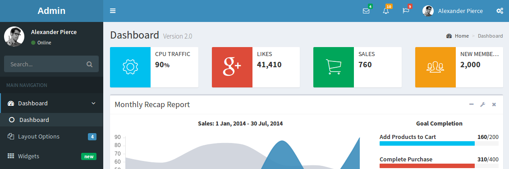

# NodeJs-Admin-LTE
Express-admin for learning and works. This project can be used for anyone who learn or use nodejs/express.js



## Getting Started

When using or learning Express.js, you may be difficult in looking for a simple, ease of use project which handle your login/admin/permisson feature. It's which this project provide you. Its features contain:

* Login/logout/hash password with bcrypt, passport
* User Role and Permission for any request
* Winston log and log viewer
* UI for all function in EJS

The project's also helpful if you have a large system. For example: You can use it as a front-end (handle user/role) and use to request to others inside back-end server. Nodejs's good for highload web system.

I hope it can help you. Leave a github star if you like it.

## Requirements

- Nodejs v8.*

## Quickstart

You can download nodejs-ejs-adminlte by directly download from github. Or you can use git command to clone it:

```
git clone https://github.com/kripesh123/nodejs-ejs-adminlte.git
```

### Install dependencies

Inside the cloned folder, run the following commandline:

```
npm install
```

### Start for production environments

```
npm run start
```
Then server now running on localhost:8080 in your browser

### Start as developer

```
npm run dev
```
Then server now running on localhost:8080 in your browser

## Usage

Links

* /: Default page use as Welcome page
* /widgets: Widgets Page

Coming soon:

* /login: Page for user login
* /auth-api: Request to outside api to login
* /index: Default page after user logined
* /admin: Page to user-management, role/permisson control. You can add new user, new role, new permission here
* /admin/log: For log viewer
* /profile: Example profile


## Authors

* [Kripesh Bista](https://github.com/kripesh123)
* [JRichardsz](https://github.com/jrichardsz)

## License

This project is licensed under the MIT License - see the [LICENSE.md](LICENSE.md) file for details
